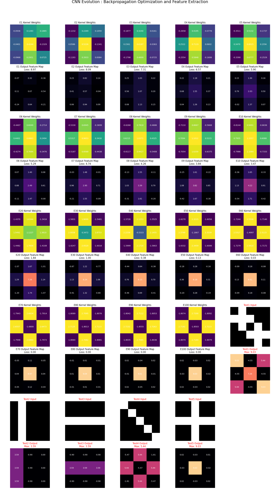

# Neural Network Fundamentals

这个目录包含神经网络基础概念的演示和学习代码，重点展示反向传播算法和卷积神经网络的工作原理。

## 文件说明

### 1. `backprop_demo.py`
**反向传播演示程序**

- **功能**：演示普通的反向传播过程，展示如何通过梯度下降优化卷积核参数
- **主要内容**：
  - 创建一个5x5的输入图像，中心位置形成"十字"形图案
  - 定义一个3x3的卷积层来学习这个十字形特征
  - 使用MSELoss损失函数和SGD优化器
  - 训练100个epoch，每10个epoch打印一次loss和梯度信息
  
**运行方式**：
```bash
python backprop_demo.py
```

### 2. `cnn_detector_trainer.py`
**十字形检测器可视化训练程序**

- **功能**：详细的十字形图案检测器训练，并动态可视化核权重和特征图的演变过程
- **主要内容**：
  - 创建5×5的十字形输入图片，目标是训练卷积核识别中心的十字特征
  - 定义3×3卷积核，使用Adam优化器进行100个epoch的训练
  - 在关键epoch（第1-10, 20, 30, ...100个）处捕获卷积核权重和输出特征图
  - 使用MSELoss作为损失函数，优化卷积核参数
  - 包含对比测试：用非十字形图案测试训练好的检测器
  - 生成可视化图表，展示：
    - 卷积核权重的演变（热力图展示）
    - 输出特征图的变化（包括loss值）
    - 每个像素数值都带有具体标注
    - 最后一列为对比测试的输入和输出

**运行方式**：
```bash
python cnn_detector_trainer.py
```

**输出说明**：
程序执行后会生成一个可视化图表文件 `cnn_evolution_with_labels.png`，展示整个训练过程。



该图表的解读：
- **上半行（Kernel Weights）**: 显示卷积核在不同训练阶段的权重变化
  - 初始阶段权重随机分布
  - 训练过程中逐步调整以匹配十字形特征
  - 最终收敛到识别中心十字的最优权重
  
- **下半行（Output Feature Map）**: 显示卷积规在各阶段对输入的响应
  - Loss值逐步下降，说明优化成功
  - 输出逐渐集中在中心（对应十字形中心位置）
  - 最终形成以中心为高峰的特征响应
  
- **右列（TEST部分）**: 
  - TEST Input 显示一个非十字形的对比图案
  - TEST Output 显示训练好的检测器对这个图案的响应较弱
  - 说明网络成功学习了十字形的特定特征，而非泛化特征

## 学习要点

这些代码演示了以下核心概念：

1. **前向传播（Forward Pass）**: 输入数据通过卷积层生成输出
2. **损失计算**: 使用损失函数衡量预测与目标的差距
3. **反向传播（Backpropagation）**: 计算每个参数对损失的偏导数（梯度）
4. **参数更新**: 使用优化器（SGD或Adam）根据梯度更新权重
5. **可视化学习过程**: 观察网络如何逐步学习识别特定图案

## 依赖库

- `torch` - PyTorch深度学习框架
- `matplotlib` - 用于可视化

## 应用场景

这些演示代码适合用于：
- 学习神经网络基础理论
- 理解卷积神经网络中的梯度流动
- 可视化优化过程和网络学习动态
